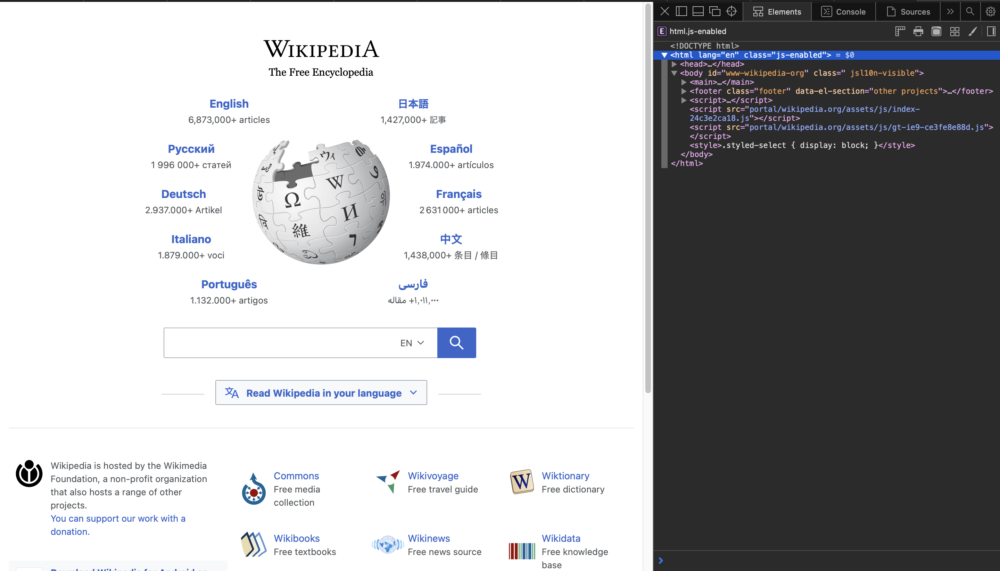
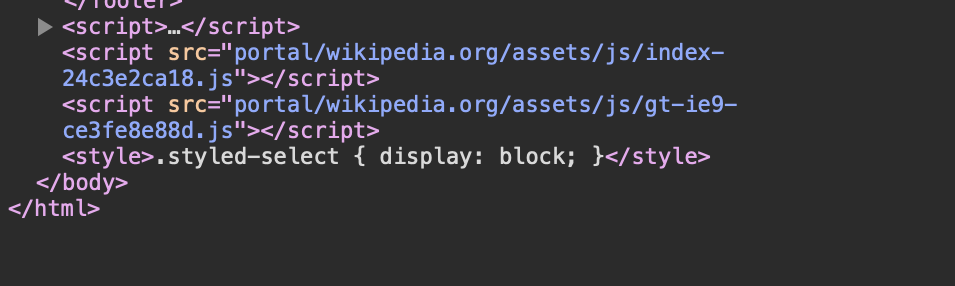

SOURCE & STYLE

The website I decided to inspect was the home page of wikipedia. 
https://www.wikipedia.org/

While inspecting, I noticed that the website used html and jave to use build the 
website.
In the screenshot below, it starts off using html, to develope the structure of the 
websites such as the heading,wording, images. Then closer to the bottom, <script> 
indicates that there is a program linked to it. In this case, the program is using 
java due to the .js in the files. It also is using css as it is telling the program how each type of element should be.

For the amount of people who created the website, I can't find the 
specific number of people. However, the overall page for wikipedia is 
powered through MediaWiki where volunteers and staff help contribute to 
the coding of the page. From their git repositiory there are 661 
contributors to the page.
here is the link: https://github.com/wikimedia/mediawiki
